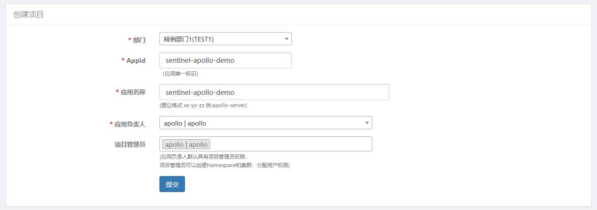
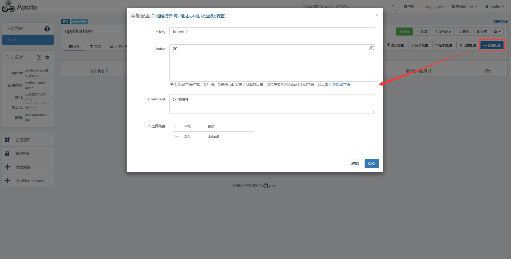
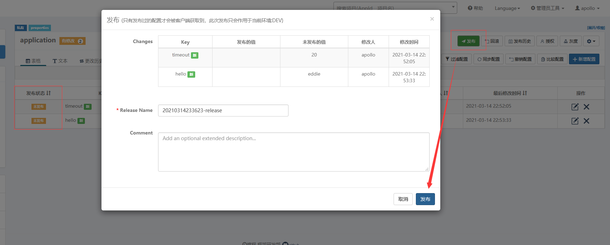
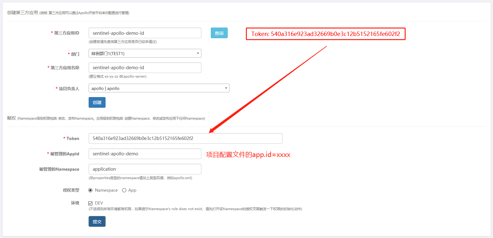
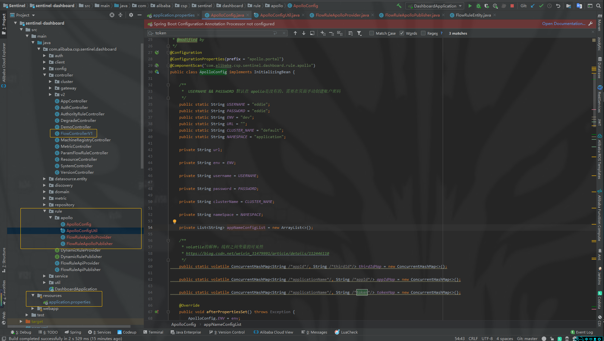
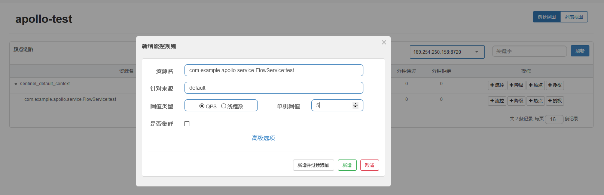
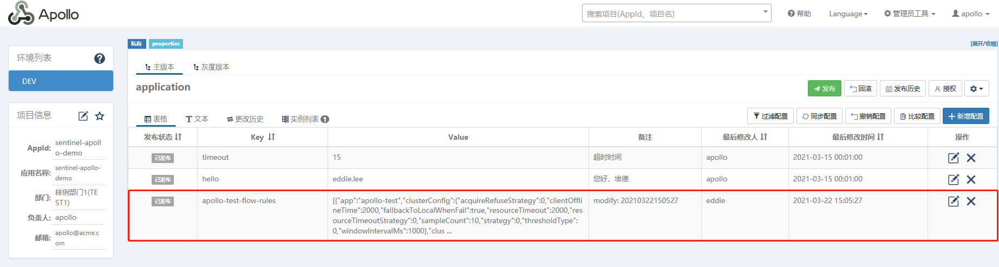
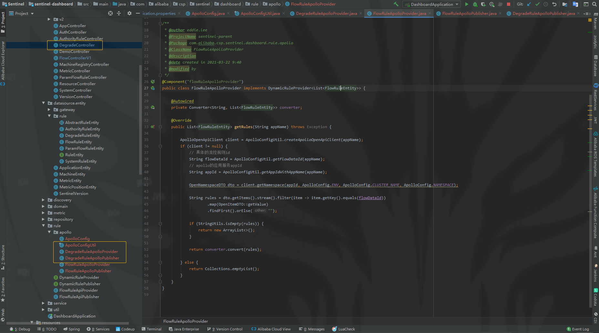
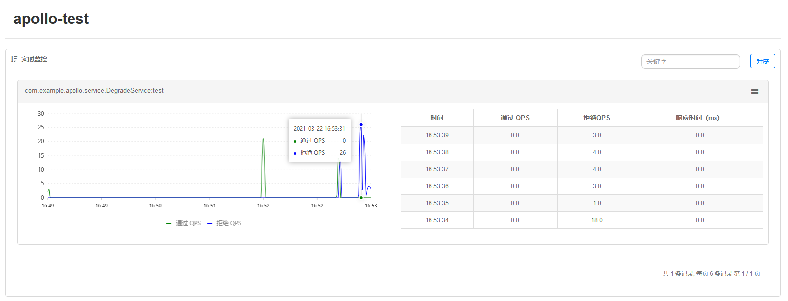
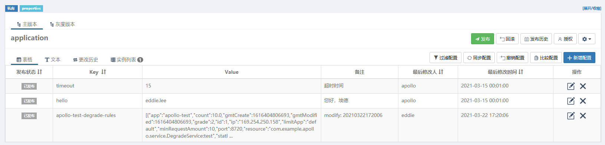

[TOC]

# 目录

- 版本
  - Sentinel 控制台 1.8.2
  - 链接：https://pan.baidu.com/s/1Hsyn4qcAhkWEFaI5rRksMw 提取码：m0eg 

##  2-1 本章概述

- Sentinel 生产环境下如何使用
- 自定义规则持久化扩展实战 
  - 快速使用 Apollo
  - 开放平台
  - Apollo OpenAPI使用
  - Sentinel Dashboard 扩展实战

## 2-2 生产环境下如何使用Sentinel?

- 规则管理
- 规则推送
- 流量监控

### 规则管理及推送


推送模式 | 说明 | 优点 | 缺点
---|---|---|---
原始模式 | API将规则推送至客户端并直接更新到内存中, 扩展写数据源 (++WritableDateSource++) | 简单, 无任何依赖 | 不保证一致性; 规则保存在内存中, 重启立即消失. 严重不建议用于生产环境
Pull 模式 | 扩展写数据源 (++WritableDateSource++), 客户端主动向某个规则管理中心定期轮询拉取规则, 这个规则中心可以是 RDBMS、文件等 | 简单, 无任何依赖; 规则持久化 | 不保证一致性; 实时性不保证, 拉取过于频繁也可能会有性能问题.
Push 模式 | 扩展读数据源 (++ReadableDateSource++), 规则中心统一推送, 客户端通过注册监听器的方式时刻监听变化, 比如使用 Nacos、 Zookeeper 等配置中心. 这种方式有更好的实时性和一致性的保证, **生产环境下一般采用 push 模式的数据源** | 规则持久化; 一致性; 快速 | 引入第三方依赖

## 2-3 Apollo快速使用-1

### 链接
- [Github 网址](https://github.com/ctripcorp/apollo)
- [快速开始](https://ctripcorp.github.io/apollo/#/zh/deployment/quick-start)

### 安装包方式

#### 1.1 准备工作
- java 1.8+
- Maven
- MySQL 5.6.5+

#### 1.2 下载安装包
- Github
  - checkout或下载apollo-build-scripts项目
- BaiduYunPan
  - https://pan.baidu.com/share/init?surl=Ieelw6y3adECgktO0ea0Gg 提取码: 9wwe

#### 1.3 创建数据库
- 解压安装包里面有sql文件夹
  - apolloconfigdb.sql  
  - apolloportaldb.sql
  - 运行语句即可

#### 1.4 配置数据库连接
```
#apollo config db info
apollo_config_db_url="jdbc:mysql://localhost:3306/ApolloConfigDB?characterEncoding=utf8&serverTimezone=Asia/Shanghai"
apollo_config_db_username=用户名
apollo_config_db_password=密码（如果没有密码，留空即可）

# apollo portal db info
apollo_portal_db_url="jdbc:mysql://localhost:3306/ApolloPortalDB?characterEncoding=utf8&serverTimezone=Asia/Shanghai"
apollo_portal_db_username=用户名
apollo_portal_db_password=密码（如果没有密码，留空即可）
```

> 注意：不要修改demo.sh的其它部分

#### 1.5 启动服务
查看端口是否占用, 分别是8070, 8080, 8090端口

#### 1.6 执行启动脚本

```shell
[root@k8s-master1 apollo]# pwd
/opt/apollo
[root@k8s-master1 apollo]# ./demo.sh start

==== starting service ====
Service logging file is ./service/apollo-service.log
Application is running as root (UID 0). This is considered insecure.
Started [24036]
Waiting for config service startup..
Config service started. You may visit http://localhost:8080 for service status now!
Waiting for admin service startup.
Admin service started
==== starting portal ====
Portal logging file is ./portal/apollo-portal.log
Application is running as root (UID 0). This is considered insecure.
Started [24335]
Waiting for portal startup..
Portal started. You can visit http://localhost:8070 now!
```

#### 1.7 访问项目

http://localhost:8070

## 2-4 Apollo快速使用-2

### Quick start

（1）添加Maven依赖
```xml
<dependencies>

    <dependency>
        <groupId>org.springframework.boot</groupId>
        <artifactId>spring-boot-starter-web</artifactId>
    </dependency>
    <dependency>
        <groupId>org.springframework.boot</groupId>
        <artifactId>spring-boot-starter-test</artifactId>
        <scope>test</scope>
    </dependency>

    <dependency>
        <groupId>com.alibaba.csp</groupId>
        <artifactId>sentinel-core</artifactId>
        <version>1.6.3</version>
    </dependency>

    <dependency>
        <groupId>com.alibaba.csp</groupId>
        <artifactId>sentinel-transport-simple-http</artifactId>
        <version>1.6.3</version>
    </dependency>

    <dependency>
        <groupId>com.alibaba.csp</groupId>
        <artifactId>sentinel-annotation-aspectj</artifactId>
        <version>1.6.3</version>
    </dependency>

    <dependency>
        <groupId>com.ctrip.framework.apollo</groupId>
        <artifactId>apollo-client</artifactId>
        <version>1.4.0</version>
    </dependency>

    <dependency>
        <groupId>com.alibaba.csp</groupId>
        <artifactId>sentinel-datasource-extension</artifactId>
        <version>1.6.3</version>
    </dependency>

    <dependency>
        <groupId>com.alibaba.csp</groupId>
        <artifactId>sentinel-datasource-apollo</artifactId>
        <version>1.6.3</version>
    </dependency>

</dependencies>
```

（2） Yaml配置文件
```yaml
###################################################
#
#    Spring基础配置
#
###################################################
spring:
  application:
    name: sentinel-apollo-demo
  http:
    encoding:
      charset: utf-8
  jackson:
    date-format: yyyy-MM-dd HH:mm:ss
    time-zone: GMT+8
    default-property-inclusion: non_null
###################################################
#
#    Server基础配置
#
###################################################
server:
  port: 8081
  servlet:
    context-path: /
###################################################
#
#    Apollp基础配置
#
###################################################
app:
  id: sentinel-apollo-demo # apollo applicaiton.id
apollo:
  meta: http://localhost:8080 # apollo-config-service eureka.address
```

（3）打开 Apollo Web

http://localhost:8070



新增配置



（4）创建配置实体与控制层请求

com.example.apollo.config.ApolloConfigBean
```java
@Data
@Configuration
public class ApolloConfigBean {

    @Value("${timeout:10}")
    private int timeout;

    @Value("${hello:'admin'}")
    private String hello;

}
```

com.example.apollo.controller.DemoController
```java
@Slf4j
@RestController
public class DemoController {

    @Autowired
    private ApolloConfigBean apolloConfigBean;

    @GetMapping("/index")
    public String index() {
        log.info("timout: [{}], hello: [{}]",
                apolloConfigBean.getTimeout(),
                apolloConfigBean.getHello()
        );
        return "timout: ["+apolloConfigBean.getTimeout()+"], hello: ["+apolloConfigBean.getHello()+"]";
    }

}
```

查看控制台信息
```text
## 请求接口
GET localhost:8081/index

## 日志打印 (无论请求多少次，得到也是代码里面的默认值)
2021-03-14 23:13:08.581  INFO 15704 --- [nio-8081-exec-2] c.e.com.example.apollo.controller.DemoController     : timout: [10], hello: ['admin']
```

查看Web端



> 发布状态 -> "未发布" -> "已发布"


再次请求 GET localhost:8081/index

```text
2021-03-14 23:55:18.039  INFO 19396 --- [nio-8081-exec-2] o.a.c.c.C.[Tomcat].[localhost].[/]       : Initializing Spring DispatcherServlet 'dispatcherServlet'
2021-03-14 23:55:18.039  INFO 19396 --- [nio-8081-exec-2] o.s.web.servlet.DispatcherServlet        : Initializing Servlet 'dispatcherServlet'
2021-03-14 23:55:18.045  INFO 19396 --- [nio-8081-exec-2] o.s.web.servlet.DispatcherServlet        : Completed initialization in 6 ms
2021-03-14 23:55:18.061  INFO 19396 --- [nio-8081-exec-2] c.e.com.example.apollo.controller.DemoController     : timout: [20], hello: [eddie]
```

> 无论在 Apollo Web 怎么修改都好, 记得点击“发布”, 数据才会同步的


## 2-5 Apollo第三方授权

- 管理员工具 
  - 开放平台来对配置进行管理
  


## 2-8 Sentinel整合Apollo配置文件解析与ApolloOpenApiClient创建-1

（一）[Download Sentinel](https://github.com/alibaba/Sentinel)

（二）sentinel-apollo-demo --> apollo --> 修改 jvm 参数
```java
-Dcsp.sentinel.dashboard.server=localhost:8080
-Dcsp.sentinel.api.port=8719
-Dproject.name=apollo-test
```

## 2-{8,12} Sentinel-dashboard 项目修改

（一） 需要创建与修改的文件



修改 Sentinel --> sentinel-dashboard --> application.properties (最底部追加, 不修改原有配置)
```properties
#spring settings
spring.http.encoding.force=true
spring.http.encoding.charset=UTF-8
spring.http.encoding.enabled=true

#cookie name setting
server.servlet.session.cookie.name=sentinel_dashboard_cookie

#logging settings
logging.level.org.springframework.web=INFO
logging.file=${user.home}/logs/csp/sentinel-dashboard.log
logging.pattern.file= %d{yyyy-MM-dd HH:mm:ss} [%thread] %-5level %logger{36} - %msg%n
#logging.pattern.console= %d{yyyy-MM-dd HH:mm:ss} [%thread] %-5level %logger{36} - %msg%n

#auth settings
auth.filter.exclude-urls=/,/auth/login,/auth/logout,/registry/machine,/version
auth.filter.exclude-url-suffixes=htm,html,js,css,map,ico,ttf,woff,png
# If auth.enabled=false, Sentinel console disable login
auth.username=sentinel
auth.password=sentinel

# Inject the dashboard version. It's required to enable
# filtering in pom.xml for this resource file.
sentinel.dashboard.version=@project.version@

########################################
## apollo配置信息
########################################

## apollo服务地址
apollo.portal.url=http://192.168.8.240:8070

## 组合使用
## 应用服务名称：apollo-test (这个是 sentinel-apollo-demo --> apollo --> 修改 jvm 参数：-Dproject.name=apollo-test)
## apollo token: 540a316e923ad32669b0e3c12b5152165fe602f2
## apollo appId: sentinel-apollo-demo (这个是 sentinel-apollo-demo -> apollo -> application.yml # app.id 的参数)
## apollo thirdId：sentinel-apollo-demo-id (第三方应用ID)
apollo.portal.appNameConfigList[0]=apollo-test:540a316e923ad32669b0e3c12b5152165fe602f2:sentinel-apollo-demo:sentinel-apollo-demo-id

## 所属环境
apollo.portal.env=DEV

## 管理用户
apollo.portal.username=eddie
apollo.portal.password=123456

## 集群名称
apollo.portal.clusterName=default

## namespace
apollo.portal.nameSpace=application
```

> Apollo Web 查看 apollo token  <br> 1. 管理员工具 <br> 2. 开放平台授权管理

com.alibaba.csp.sentinel.dashboard.rule.apollo.ApolloConfig
```java
package com.alibaba.csp.sentinel.dashboard.rule.apollo;

import com.alibaba.csp.sentinel.dashboard.datasource.entity.gateway.ApiDefinitionEntity;
import com.alibaba.csp.sentinel.dashboard.datasource.entity.gateway.GatewayFlowRuleEntity;
import com.alibaba.csp.sentinel.dashboard.datasource.entity.rule.*;
import com.alibaba.csp.sentinel.datasource.Converter;
import com.alibaba.fastjson.JSON;
import org.springframework.beans.factory.InitializingBean;
import org.springframework.boot.context.properties.ConfigurationProperties;
import org.springframework.context.annotation.Bean;
import org.springframework.context.annotation.ComponentScan;
import org.springframework.context.annotation.Configuration;

import java.util.ArrayList;
import java.util.List;
import java.util.concurrent.ConcurrentHashMap;

/**
 * @author eddie.lee
 * @ProjectName sentinel-parent
 * @Package com.alibaba.csp.sentinel.dashboard.rule.apollo
 * @ClassName ApolloConfig
 * @description
 * @date created in 2021-03-18 16:08
 * @modified by
 */
@Configuration
@ConfigurationProperties(prefix = "apollo.portal")
@ComponentScan("com.alibaba.csp.sentinel.dashboard.rule.apollo")
public class ApolloConfig implements InitializingBean {

    /**
     *  USERNAME && PASSWORD 默认在 apollo是没有的，需要在页面手动创建账户密码
     */
    public static String USERNAME = "eddie";
    public static String PASSWORD = "eddie";
    public static String ENV = "dev";
    public static String URL = "";
    public static String CLUSTER_NAME = "default";
    public static String NAMESPACE = "application";

    private String url;

    private String env = ENV;

    private String username = USERNAME;

    private String password = PASSWORD;

    private String clusterName = CLUSTER_NAME;

    private String nameSpace = NAMESPACE;

    private List<String> appNameConfigList = new ArrayList<>();

    /**
     * volatile的解释：线程之间变量的可见性
     * https://blog.csdn.net/weixin_31479991/article/details/112446110
     */
    public static volatile ConcurrentHashMap<String /*appId*/, String /*thirdId*/> thirdIdMap = new ConcurrentHashMap<>();

    public static volatile ConcurrentHashMap<String /*applicationName*/, String /*appId*/> appIdMap = new ConcurrentHashMap<>();

    public static volatile ConcurrentHashMap<String /*applicationName*/, String /*token*/> tokenMap = new ConcurrentHashMap<>();

    @Override
    public void afterPropertiesSet() throws Exception {
        ApolloConfig.ENV = env;
        ApolloConfig.USERNAME = username;
        ApolloConfig.CLUSTER_NAME = clusterName;
        ApolloConfig.NAMESPACE = nameSpace;
        ApolloConfig.URL = url;

        this.appNameConfigList.forEach(item -> {
            String[] items = item.split(":");
            if (items.length == 4) {
                String applicationName = items[0];
                String token = items[1];
                String appId = items[2];
                String thirdId = items[3];

                thirdIdMap.putIfAbsent(appId, thirdId);
                appIdMap.putIfAbsent(applicationName, appId);
                tokenMap.putIfAbsent(applicationName, token);
            }
        });
    }

    /**
     * 流控规则
     *
     * @return
     */
    @Bean
    public Converter<List<FlowRuleEntity>, String> flowRuleEntityEncoder() {
        return JSON::toJSONString;
    }

    @Bean
    public Converter<String, List<FlowRuleEntity>> flowRuleEntityDecoder() {
        return s -> JSON.parseArray(s, FlowRuleEntity.class);
    }

    /**
     * 授权规则
     *
     * @return
     */
    @Bean
    public Converter<List<AuthorityRuleEntity>, String> authorRuleEntityEncoder() {
        return JSON::toJSONString;
    }

    @Bean
    public Converter<String, List<AuthorityRuleEntity>> authorRuleEntityDecoder() {
        return s -> JSON.parseArray(s, AuthorityRuleEntity.class);
    }

    /**
     * 降级规则
     *
     * @return
     */
    @Bean
    public Converter<List<DegradeRuleEntity>, String> degradeRuleEntityEncoder() {
        return JSON::toJSONString;
    }

    @Bean
    public Converter<String, List<DegradeRuleEntity>> degradeRuleEntityDecoder() {
        return s -> JSON.parseArray(s, DegradeRuleEntity.class);
    }

    /**
     * 热点参数 规则
     *
     * @return
     */
    @Bean
    public Converter<List<ParamFlowRuleEntity>, String> paramRuleEntityEncoder() {
        return JSON::toJSONString;
    }

    @Bean
    public Converter<String, List<ParamFlowRuleEntity>> paramRuleEntityDecoder() {
        return s -> JSON.parseArray(s, ParamFlowRuleEntity.class);
    }

    /**
     * 系统规则
     *
     * @return
     */
    @Bean
    public Converter<List<SystemRuleEntity>, String> systemRuleEntityEncoder() {
        return JSON::toJSONString;
    }

    @Bean
    public Converter<String, List<SystemRuleEntity>> systemRuleEntityDecoder() {
        return s -> JSON.parseArray(s, SystemRuleEntity.class);
    }

    /**
     * 网关API
     *
     * @return
     * @throws Exception
     */
    @Bean
    public Converter<List<ApiDefinitionEntity>, String> apiDefinitionEntityEncoder() {
        return JSON::toJSONString;
    }

    @Bean
    public Converter<String, List<ApiDefinitionEntity>> apiDefinitionEntityDecoder() {
        return s -> JSON.parseArray(s, ApiDefinitionEntity.class);
    }

    /**
     * 网关flowRule
     *
     * @return
     * @throws Exception
     */
    @Bean
    public Converter<List<GatewayFlowRuleEntity>, String> gatewayFlowRuleEntityEncoder() {
        return JSON::toJSONString;
    }

    @Bean
    public Converter<String, List<GatewayFlowRuleEntity>> gatewayFlowRuleEntityDecoder() {
        return s -> JSON.parseArray(s, GatewayFlowRuleEntity.class);
    }

    //****************************
    //  get / set
    //****************************

    public String getUrl() {
        return url;
    }

    public void setUrl(String url) {
        this.url = url;
    }

    public String getEnv() {
        return env;
    }

    public void setEnv(String env) {
        this.env = env;
    }

    public String getUsername() {
        return username;
    }

    public void setUsername(String username) {
        this.username = username;
    }

    public String getPassword() {
        return password;
    }

    public void setPassword(String password) {
        this.password = password;
    }

    public String getClusterName() {
        return clusterName;
    }

    public void setClusterName(String clusterName) {
        this.clusterName = clusterName;
    }

    public String getNameSpace() {
        return nameSpace;
    }

    public void setNameSpace(String nameSpace) {
        this.nameSpace = nameSpace;
    }

    public List<String> getAppNameConfigList() {
        return appNameConfigList;
    }

    public void setAppNameConfigList(List<String> appNameConfigList) {
        this.appNameConfigList = appNameConfigList;
    }
}
```

com.alibaba.csp.sentinel.dashboard.rule.apollo.ApolloConfigUtil
```java
package com.alibaba.csp.sentinel.dashboard.rule.apollo;


import com.ctrip.framework.apollo.openapi.client.ApolloOpenApiClient;
import org.apache.commons.lang.StringUtils;

import java.util.concurrent.ConcurrentHashMap;

/**
 * @author eddie.lee
 * @ProjectName sentinel-parent
 * @Package com.alibaba.csp.sentinel.dashboard.rule.apollo
 * @ClassName ApolloConfig
 * @description
 * @date created in 2021-03-18 16:08
 * @modified by
 */
public final class ApolloConfigUtil {

    /**
     * 流控
     * *-flow-rules
     * apollo-test-flow-rules
     */
    private static final String FLOW_RULE_TYPE = "flow";
    private static final String FLOW_DATA_ID_POSTFIX = "-" + FLOW_RULE_TYPE + "-rules";

    public static String getFlowDataId(String appName) {
        return String.format("%s%s", appName, FLOW_DATA_ID_POSTFIX);
    }


    /**
     * 降级
     * *-degrade-rules
     * apollo-test-degrade-rules
     */
    private static final String DEGRADE_RULE_TYPE = "degrade";
    private static final String DEGRADE_DATA_ID_POSTFIX = "-" + DEGRADE_RULE_TYPE + "-rules";

    public static String getDegradeDataId(String appName) {
        return String.format("%s%s", appName, DEGRADE_DATA_ID_POSTFIX);
    }

    private static ConcurrentHashMap<String, ApolloOpenApiClient> APOLLOOPENAPICLIENTMAP = new ConcurrentHashMap<>();

    /**
     *
     * <!-- for Apollo rule publisher sample -->
     * <dependency>
     * <groupId>com.ctrip.framework.apollo</groupId>
     * <artifactId>apollo-openapi</artifactId>
     * <version>1.2.0</version>
     * <!--<scope>test</scope>-->   屏蔽了 才能导入 ApolloOpenApiClient 类
     * </dependency>
     */
    public static ApolloOpenApiClient createApolloOpenApiClient(String appName) {
        ApolloOpenApiClient client = APOLLOOPENAPICLIENTMAP.get(appName);
        System.out.println(client);
        if (client != null) {
            return client;
        } else {
            String token = ApolloConfig.tokenMap.get(appName);
            if (StringUtils.isNotBlank(token)) {
                client = ApolloOpenApiClient.newBuilder()
                        .withPortalUrl(ApolloConfig.URL)
                        .withToken(token)
                        .build();
                APOLLOOPENAPICLIENTMAP.putIfAbsent(appName, client);
                return client;
            } else {
                System.out.println("根据指定的appName: " + appName + ", 找不到对应的token");
                return null;
            }
        }
    }

    public static String getAppIdWithAppName(String appName) {
        return ApolloConfig.appIdMap.get(appName);
    }
}
```

com.alibaba.csp.sentinel.dashboard.rule.apollo.FlowRuleApolloProvider
```java
package com.alibaba.csp.sentinel.dashboard.rule.apollo;

import com.alibaba.csp.sentinel.dashboard.datasource.entity.rule.FlowRuleEntity;
import com.alibaba.csp.sentinel.dashboard.rule.DynamicRuleProvider;
import com.alibaba.csp.sentinel.datasource.Converter;
import com.ctrip.framework.apollo.openapi.client.ApolloOpenApiClient;
import com.ctrip.framework.apollo.openapi.dto.OpenItemDTO;
import com.ctrip.framework.apollo.openapi.dto.OpenNamespaceDTO;
import org.apache.commons.lang.StringUtils;
import org.springframework.beans.factory.annotation.Autowired;
import org.springframework.stereotype.Component;

import java.util.ArrayList;
import java.util.Collections;
import java.util.List;

/**
 * @author eddie.lee
 * @ProjectName sentinel-parent
 * @Package com.alibaba.csp.sentinel.dashboard.rule.apollo
 * @ClassName FlowRuleApolloProvider
 * @description
 * @date created in 2021-03-22 9:40
 * @modified by
 */
@Component("flowRuleApolloProvider")
public class FlowRuleApolloProvider implements DynamicRuleProvider<List<FlowRuleEntity>> {

    @Autowired
    private Converter<String, List<FlowRuleEntity>> converter;

    @Override
    public List<FlowRuleEntity> getRules(String appName) throws Exception {

        ApolloOpenApiClient client = ApolloConfigUtil.createApolloOpenApiClient(appName);
        if (client != null) {
            // 具体的流控规则id
            String flowDataId = ApolloConfigUtil.getFlowDataId(appName);
            // apollo的应用服务appId
            String appId = ApolloConfigUtil.getAppIdWithAppName(appName);

            OpenNamespaceDTO dto = client.getNamespace(appId, ApolloConfig.ENV, ApolloConfig.CLUSTER_NAME, ApolloConfig.NAMESPACE);

            String rules = dto.getItems().stream().filter(item -> item.getKey().equals(flowDataId))
                    .map(OpenItemDTO::getValue)
                    .findFirst().orElse("");

            if (StringUtils.isEmpty(rules)) {
                return new ArrayList<>();
            }

            return converter.convert(rules);

        } else {
            return Collections.emptyList();
        }
    }
}
```

com.alibaba.csp.sentinel.dashboard.rule.apollo.FlowRuleApolloPublisher
```java
package com.alibaba.csp.sentinel.dashboard.rule.apollo;

import com.alibaba.csp.sentinel.dashboard.datasource.entity.rule.FlowRuleEntity;
import com.alibaba.csp.sentinel.dashboard.rule.DynamicRulePublisher;
import com.alibaba.csp.sentinel.datasource.Converter;
import com.ctrip.framework.apollo.openapi.client.ApolloOpenApiClient;
import com.ctrip.framework.apollo.openapi.dto.NamespaceReleaseDTO;
import com.ctrip.framework.apollo.openapi.dto.OpenItemDTO;
import org.apache.commons.lang.time.FastDateFormat;
import org.springframework.beans.factory.annotation.Autowired;
import org.springframework.stereotype.Component;

import java.util.Date;
import java.util.List;

/**
 * @author eddie.lee
 * @ProjectName sentinel-parent
 * @Package com.alibaba.csp.sentinel.dashboard.rule.apollo
 * @ClassName FlowRuleApolloPublisher
 * @description
 * @date created in 2021-03-22 10:14
 * @modified by
 */
@Component("flowRuleApolloPublisher")
public class FlowRuleApolloPublisher implements DynamicRulePublisher<List<FlowRuleEntity>> {

    @Autowired
    private Converter<List<FlowRuleEntity>, String> converter;

    private static FastDateFormat FASTDATEFORMAT = FastDateFormat.getInstance("yyyyMMddHHmmss");

    /**
     * Publish rules to remote rule configuration center for given application name.
     * 将给定应用程序名称的规则发布到远程规则配置中心。
     *
     * @param appName app name
     * @param rules   list of rules to push
     * @throws Exception if some error occurs
     */
    @Override
    public void publish(String appName, List<FlowRuleEntity> rules) throws Exception {
        if (rules == null) {
            return;
        }
        ApolloOpenApiClient client = ApolloConfigUtil.createApolloOpenApiClient(appName);
        if (client != null) {
            // 具体的流控规则id
            String flowDataId = ApolloConfigUtil.getFlowDataId(appName);
            // apollo的应用服务appId
            String appId = ApolloConfigUtil.getAppIdWithAppName(appName);
            // 当前时间
            String dateFormat = FASTDATEFORMAT.format(new Date());

            OpenItemDTO openItemDTO = new OpenItemDTO();
            openItemDTO.setKey(flowDataId);
            openItemDTO.setValue(converter.convert(rules));
            openItemDTO.setComment("modify: " + dateFormat);
            openItemDTO.setDataChangeLastModifiedBy(ApolloConfig.USERNAME);
            openItemDTO.setDataChangeCreatedBy(ApolloConfig.USERNAME);
            // 1. 修改操作, 预发布
            client.createOrUpdateItem(appId, ApolloConfig.ENV, ApolloConfig.CLUSTER_NAME, ApolloConfig.NAMESPACE, openItemDTO);
            // 2. 真正的进行发布
            NamespaceReleaseDTO releaseDTO = new NamespaceReleaseDTO();
            releaseDTO.setEmergencyPublish(true);
            releaseDTO.setReleaseComment("modify comment: " + dateFormat);
            releaseDTO.setReleaseTitle("发布新属性: " + dateFormat);
            releaseDTO.setReleasedBy(ApolloConfig.USERNAME);
            client.publishNamespace(appId, ApolloConfig.ENV, ApolloConfig.CLUSTER_NAME, ApolloConfig.NAMESPACE, releaseDTO);
        } else {
            System.err.println("客户端为空，发布失败!");
        }
    }
}
```

com.alibaba.csp.sentinel.dashboard.controller.FlowControllerV1
```java
/*
 * Copyright 1999-2018 Alibaba Group Holding Ltd.
 *
 * Licensed under the Apache License, Version 2.0 (the "License");
 * you may not use this file except in compliance with the License.
 * You may obtain a copy of the License at
 *
 *      http://www.apache.org/licenses/LICENSE-2.0
 *
 * Unless required by applicable law or agreed to in writing, software
 * distributed under the License is distributed on an "AS IS" BASIS,
 * WITHOUT WARRANTIES OR CONDITIONS OF ANY KIND, either express or implied.
 * See the License for the specific language governing permissions and
 * limitations under the License.
 */
package com.alibaba.csp.sentinel.dashboard.controller;

import java.util.Date;
import java.util.List;
import java.util.concurrent.CompletableFuture;
import java.util.concurrent.ExecutionException;
import java.util.concurrent.TimeUnit;

import com.alibaba.csp.sentinel.dashboard.auth.AuthAction;
import com.alibaba.csp.sentinel.dashboard.auth.AuthService.PrivilegeType;
import com.alibaba.csp.sentinel.dashboard.rule.DynamicRuleProvider;
import com.alibaba.csp.sentinel.dashboard.rule.DynamicRulePublisher;
import com.alibaba.csp.sentinel.util.StringUtil;

import com.alibaba.csp.sentinel.dashboard.client.SentinelApiClient;
import com.alibaba.csp.sentinel.dashboard.datasource.entity.rule.FlowRuleEntity;
import com.alibaba.csp.sentinel.dashboard.discovery.MachineInfo;
import com.alibaba.csp.sentinel.dashboard.domain.Result;
import com.alibaba.csp.sentinel.dashboard.repository.rule.InMemoryRuleRepositoryAdapter;

import org.slf4j.Logger;
import org.slf4j.LoggerFactory;
import org.springframework.beans.factory.annotation.Autowired;
import org.springframework.beans.factory.annotation.Qualifier;
import org.springframework.web.bind.annotation.DeleteMapping;
import org.springframework.web.bind.annotation.GetMapping;
import org.springframework.web.bind.annotation.PostMapping;
import org.springframework.web.bind.annotation.PutMapping;
import org.springframework.web.bind.annotation.RequestBody;
import org.springframework.web.bind.annotation.RequestMapping;
import org.springframework.web.bind.annotation.RequestParam;
import org.springframework.web.bind.annotation.RestController;

/**
 * Flow rule controller.
 *
 * @author leyou
 * @author Eric Zhao
 */
@RestController
@RequestMapping(value = "/v1/flow")
public class FlowControllerV1 {

    private final Logger logger = LoggerFactory.getLogger(FlowControllerV1.class);

    @Autowired
    private InMemoryRuleRepositoryAdapter<FlowRuleEntity> repository;

    @Autowired
    private SentinelApiClient sentinelApiClient;

    //*******************************[修改或者添加部分]***********************************
    @Autowired
    @Qualifier("flowRuleApolloProvider")
    private DynamicRuleProvider<List<FlowRuleEntity>> ruleProvider;
    @Autowired
    @Qualifier("flowRuleApolloPublisher")
    private DynamicRulePublisher<List<FlowRuleEntity>> rulePublisher;
    //*******************************[修改或者添加部分]***********************************

    @GetMapping("/rules")
    @AuthAction(PrivilegeType.READ_RULE)
    public Result<List<FlowRuleEntity>> apiQueryMachineRules(@RequestParam String app,
                                                             @RequestParam String ip,
                                                             @RequestParam Integer port) {

        if (StringUtil.isEmpty(app)) {
            return Result.ofFail(-1, "app can't be null or empty");
        }
        if (StringUtil.isEmpty(ip)) {
            return Result.ofFail(-1, "ip can't be null or empty");
        }
        if (port == null) {
            return Result.ofFail(-1, "port can't be null");
        }
        try {
            //*******************************[修改或者添加部分]***********************************
            // List<FlowRuleEntity> rules = sentinelApiClient.fetchFlowRuleOfMachine(app, ip, port);
            List<FlowRuleEntity> rules = ruleProvider.getRules(app);
            //*******************************[修改或者添加部分]***********************************
            rules = repository.saveAll(rules);
            return Result.ofSuccess(rules);
        } catch (Throwable throwable) {
            logger.error("Error when querying flow rules", throwable);
            return Result.ofThrowable(-1, throwable);
        }
    }

    private <R> Result<R> checkEntityInternal(FlowRuleEntity entity) {
        if (StringUtil.isBlank(entity.getApp())) {
            return Result.ofFail(-1, "app can't be null or empty");
        }
        if (StringUtil.isBlank(entity.getIp())) {
            return Result.ofFail(-1, "ip can't be null or empty");
        }
        if (entity.getPort() == null) {
            return Result.ofFail(-1, "port can't be null");
        }
        if (StringUtil.isBlank(entity.getLimitApp())) {
            return Result.ofFail(-1, "limitApp can't be null or empty");
        }
        if (StringUtil.isBlank(entity.getResource())) {
            return Result.ofFail(-1, "resource can't be null or empty");
        }
        if (entity.getGrade() == null) {
            return Result.ofFail(-1, "grade can't be null");
        }
        if (entity.getGrade() != 0 && entity.getGrade() != 1) {
            return Result.ofFail(-1, "grade must be 0 or 1, but " + entity.getGrade() + " got");
        }
        if (entity.getCount() == null || entity.getCount() < 0) {
            return Result.ofFail(-1, "count should be at lease zero");
        }
        if (entity.getStrategy() == null) {
            return Result.ofFail(-1, "strategy can't be null");
        }
        if (entity.getStrategy() != 0 && StringUtil.isBlank(entity.getRefResource())) {
            return Result.ofFail(-1, "refResource can't be null or empty when strategy!=0");
        }
        if (entity.getControlBehavior() == null) {
            return Result.ofFail(-1, "controlBehavior can't be null");
        }
        int controlBehavior = entity.getControlBehavior();
        if (controlBehavior == 1 && entity.getWarmUpPeriodSec() == null) {
            return Result.ofFail(-1, "warmUpPeriodSec can't be null when controlBehavior==1");
        }
        if (controlBehavior == 2 && entity.getMaxQueueingTimeMs() == null) {
            return Result.ofFail(-1, "maxQueueingTimeMs can't be null when controlBehavior==2");
        }
        if (entity.isClusterMode() && entity.getClusterConfig() == null) {
            return Result.ofFail(-1, "cluster config should be valid");
        }
        return null;
    }

    @PostMapping("/rule")
    @AuthAction(PrivilegeType.WRITE_RULE)
    public Result<FlowRuleEntity> apiAddFlowRule(@RequestBody FlowRuleEntity entity) {
        Result<FlowRuleEntity> checkResult = checkEntityInternal(entity);
        if (checkResult != null) {
            return checkResult;
        }
        entity.setId(null);
        Date date = new Date();
        entity.setGmtCreate(date);
        entity.setGmtModified(date);
        entity.setLimitApp(entity.getLimitApp().trim());
        entity.setResource(entity.getResource().trim());
        try {
            entity = repository.save(entity);

            publishRules(entity.getApp(), entity.getIp(), entity.getPort()).get(5000, TimeUnit.MILLISECONDS);
            return Result.ofSuccess(entity);
        } catch (Throwable t) {
            Throwable e = t instanceof ExecutionException ? t.getCause() : t;
            logger.error("Failed to add new flow rule, app={}, ip={}", entity.getApp(), entity.getIp(), e);
            return Result.ofFail(-1, e.getMessage());
        }
    }

    @PutMapping("/save.json")
    @AuthAction(PrivilegeType.WRITE_RULE)
    public Result<FlowRuleEntity> apiUpdateFlowRule(Long id, String app,
                                                  String limitApp, String resource, Integer grade,
                                                  Double count, Integer strategy, String refResource,
                                                  Integer controlBehavior, Integer warmUpPeriodSec,
                                                  Integer maxQueueingTimeMs) {
        if (id == null) {
            return Result.ofFail(-1, "id can't be null");
        }
        FlowRuleEntity entity = repository.findById(id);
        if (entity == null) {
            return Result.ofFail(-1, "id " + id + " dose not exist");
        }
        if (StringUtil.isNotBlank(app)) {
            entity.setApp(app.trim());
        }
        if (StringUtil.isNotBlank(limitApp)) {
            entity.setLimitApp(limitApp.trim());
        }
        if (StringUtil.isNotBlank(resource)) {
            entity.setResource(resource.trim());
        }
        if (grade != null) {
            if (grade != 0 && grade != 1) {
                return Result.ofFail(-1, "grade must be 0 or 1, but " + grade + " got");
            }
            entity.setGrade(grade);
        }
        if (count != null) {
            entity.setCount(count);
        }
        if (strategy != null) {
            if (strategy != 0 && strategy != 1 && strategy != 2) {
                return Result.ofFail(-1, "strategy must be in [0, 1, 2], but " + strategy + " got");
            }
            entity.setStrategy(strategy);
            if (strategy != 0) {
                if (StringUtil.isBlank(refResource)) {
                    return Result.ofFail(-1, "refResource can't be null or empty when strategy!=0");
                }
                entity.setRefResource(refResource.trim());
            }
        }
        if (controlBehavior != null) {
            if (controlBehavior != 0 && controlBehavior != 1 && controlBehavior != 2) {
                return Result.ofFail(-1, "controlBehavior must be in [0, 1, 2], but " + controlBehavior + " got");
            }
            if (controlBehavior == 1 && warmUpPeriodSec == null) {
                return Result.ofFail(-1, "warmUpPeriodSec can't be null when controlBehavior==1");
            }
            if (controlBehavior == 2 && maxQueueingTimeMs == null) {
                return Result.ofFail(-1, "maxQueueingTimeMs can't be null when controlBehavior==2");
            }
            entity.setControlBehavior(controlBehavior);
            if (warmUpPeriodSec != null) {
                entity.setWarmUpPeriodSec(warmUpPeriodSec);
            }
            if (maxQueueingTimeMs != null) {
                entity.setMaxQueueingTimeMs(maxQueueingTimeMs);
            }
        }
        Date date = new Date();
        entity.setGmtModified(date);
        try {
            entity = repository.save(entity);
            if (entity == null) {
                return Result.ofFail(-1, "save entity fail: null");
            }

            publishRules(entity.getApp(), entity.getIp(), entity.getPort()).get(5000, TimeUnit.MILLISECONDS);
            return Result.ofSuccess(entity);
        } catch (Throwable t) {
            Throwable e = t instanceof ExecutionException ? t.getCause() : t;
            logger.error("Error when updating flow rules, app={}, ip={}, ruleId={}", entity.getApp(),
                entity.getIp(), id, e);
            return Result.ofFail(-1, e.getMessage());
        }
    }

    @DeleteMapping("/delete.json")
    @AuthAction(PrivilegeType.WRITE_RULE)
    public Result<Long> apiDeleteFlowRule(Long id) {

        if (id == null) {
            return Result.ofFail(-1, "id can't be null");
        }
        FlowRuleEntity oldEntity = repository.findById(id);
        if (oldEntity == null) {
            return Result.ofSuccess(null);
        }

        try {
            repository.delete(id);
        } catch (Exception e) {
            return Result.ofFail(-1, e.getMessage());
        }
        try {
            publishRules(oldEntity.getApp(), oldEntity.getIp(), oldEntity.getPort()).get(5000, TimeUnit.MILLISECONDS);
            return Result.ofSuccess(id);
        } catch (Throwable t) {
            Throwable e = t instanceof ExecutionException ? t.getCause() : t;
            logger.error("Error when deleting flow rules, app={}, ip={}, id={}", oldEntity.getApp(),
                oldEntity.getIp(), id, e);
            return Result.ofFail(-1, e.getMessage());
        }
    }

    private CompletableFuture<Void> publishRules(String app, String ip, Integer port) {
        List<FlowRuleEntity> rules = repository.findAllByMachine(MachineInfo.of(app, ip, port));
        //*******************************[修改或者添加部分]***********************************
        try {
            rulePublisher.publish(app, rules);
        } catch (Exception e) {
            e.printStackTrace();
        }
        //*******************************[修改或者添加部分]***********************************
        return sentinelApiClient.setFlowRuleOfMachineAsync(app, ip, port, rules);
    }
}
```

## 2-13 sentinel-apollo-demo.apollo 监听流控与降级

com.example.apollo.config.ApolloDataSourceListener
```java
package com.example.apollo.config;

import com.alibaba.csp.sentinel.datasource.ReadableDataSource;
import com.alibaba.csp.sentinel.datasource.apollo.ApolloDataSource;
import com.alibaba.csp.sentinel.slots.block.flow.FlowRule;
import com.alibaba.csp.sentinel.slots.block.flow.FlowRuleManager;
import com.alibaba.fastjson.JSON;
import com.alibaba.fastjson.TypeReference;
import org.springframework.beans.factory.InitializingBean;

import java.util.List;

/**
 * @author eddie.lee
 * @ProjectName sentinel-apollo-demo
 * @Package com.example.apollo.config
 * @ClassName ApolloDataSourceListener
 * @description
 * @date created in 2021-03-22 12:42
 * @modified by
 */
public class ApolloDataSourceListener implements InitializingBean {

    private String applicationName;

    // *-flow-rules
    private static final String FLOW_RULE_TYPE = "flow";
    private static final String FLOW_DATA_ID_POSTFIX = "-" + FLOW_RULE_TYPE + "-rules";

    private static final String DEGRADE_RULE_TYPE = "degrade";
    private static final String DEGRADE_DATA_ID_POSTFIX = "-" + DEGRADE_RULE_TYPE + "-rules";

    public ApolloDataSourceListener(String applicationName) {
        this.applicationName = applicationName;
    }

    @Override
    public void afterPropertiesSet() throws Exception {
        initFlowRules();
    }

    /**
     * 流控监听
     */
    private void initFlowRules() {
        // apollo-demo-flow-rules
        String flowRuleKey = applicationName + FLOW_DATA_ID_POSTFIX;
        // 动态监听
        ReadableDataSource<String, List<FlowRule>> flowRuleDataSource =
                new ApolloDataSource<>("application",
                        flowRuleKey,
                        "[]",
                        source -> JSON.parseObject(source, new TypeReference<List<FlowRule>>() {
                        }));
        // 刷新内存
        FlowRuleManager.register2Property(flowRuleDataSource.getProperty());
    }
}
```

com.example.apollo.config.SentinelApolloConfig
```java
package com.example.apollo.config;

import com.alibaba.csp.sentinel.annotation.aspectj.SentinelResourceAspect;
import org.springframework.beans.factory.annotation.Value;
import org.springframework.boot.autoconfigure.condition.ConditionalOnMissingBean;
import org.springframework.context.annotation.Bean;
import org.springframework.context.annotation.Configuration;

/**
 * @author eddie.lee
 * @ProjectName sentinel-apollo-demo
 * @Package com.example.apollo.config
 * @ClassName Sentinel4ApolloConfig
 * @description
 * @date created in 2021-03-22 12:38
 * @modified by
 */
@Configuration
public class SentinelApolloConfig {

    @Value("${spring.application.name}")
    private String applicationName = "";

    @Bean
    @ConditionalOnMissingBean
    public SentinelResourceAspect sentinelresourceaspect() {
        return new SentinelResourceAspect();
    }

    @Bean
    @ConditionalOnMissingBean
    public ApolloDataSourceListener apolloDataSourceListener() {
        return new ApolloDataSourceListener(applicationName);
    }
}
```

在创建控制层与业务层

com.example.apollo.controller.DemoController#test
```java
@GetMapping("/test")
public String test() {
    return flowService.test();
}
```

com.example.apollo.service.impl.FlowServiceImpl
```java
@Service
public class FlowServiceImpl implements FlowService {

    /**
     * test
     *
     * @return str
     */
    @SentinelResource(
            value = "com.example.apollo.service.FlowService:test",
            blockHandler = "testblockHandler"
    )
    @Override
    public String test() {
        System.out.println("正常执行");
        return "test";
    }

    public String testblockHandler(BlockException e) {
        System.err.println("流控执行： " + e);
        return "流控执行";
    }
}
```

### 流控测试

1. 连续疯狂请求 http://localhost:8081/test
1. 打开 Sentinel 控制台 1.8.2 -  http://localhost:8080



#### Console打印
```text
流控执行： com.alibaba.csp.sentinel.slots.block.flow.FlowException
流控执行： com.alibaba.csp.sentinel.slots.block.flow.FlowException
正常执行
正常执行
正常执行
正常执行
流控执行： com.alibaba.csp.sentinel.slots.block.flow.FlowException
```




### 降级测试 (仿照流控)



1. 仿照流控编写降级代码 DegradeRuleApolloProvider、DegradeRuleApolloPublisher
1. 连续疯狂请求 http://localhost:8081/testDegrade
1. 打开 Sentinel 控制台 1.8.2 -  http://localhost:8080
1. 降级使用 - 异常数



#### Console打印
```text
----> 正常执行degrade方法
----> 正常执行degrade方法
----> 正常执行degrade方法
----> 触发异常时的降级策略：java.lang.RuntimeException: 1.2.4.7 不等于 0, 抛出业务异常：0
----> 触发降级流控策略：com.alibaba.csp.sentinel.slots.block.degrade.DegradeException
----> 触发降级流控策略：com.alibaba.csp.sentinel.slots.block.degrade.DegradeException
----> 触发降级流控策略：com.alibaba.csp.sentinel.slots.block.degrade.DegradeException
----> 触发降级流控策略：com.alibaba.csp.sentinel.slots.block.degrade.DegradeException
```

