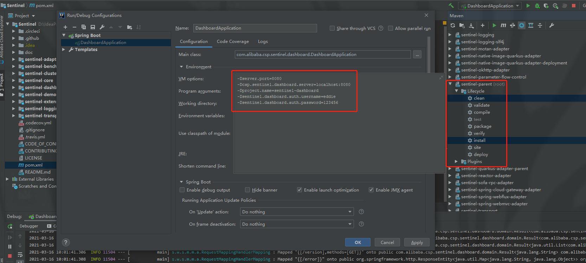
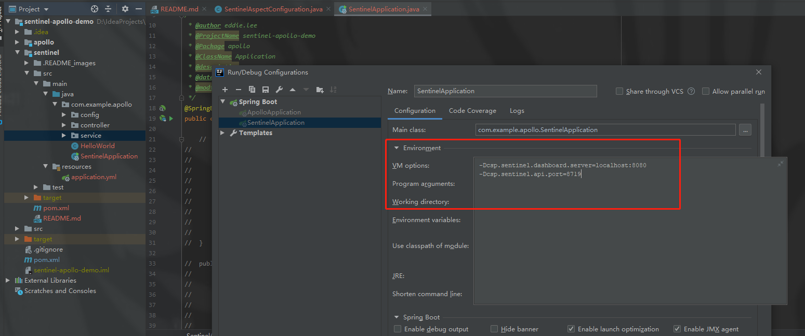
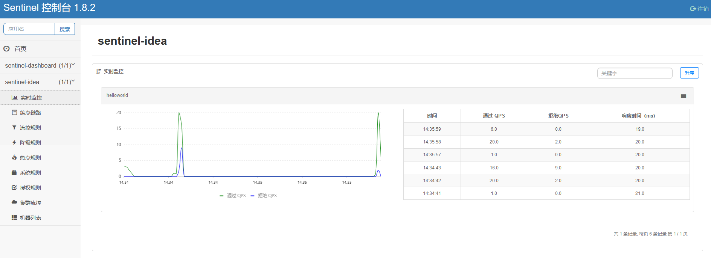
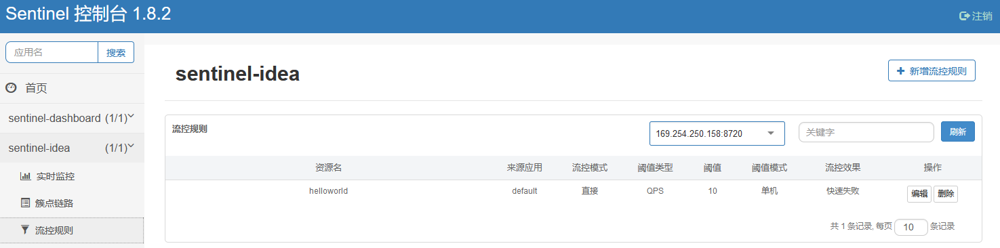
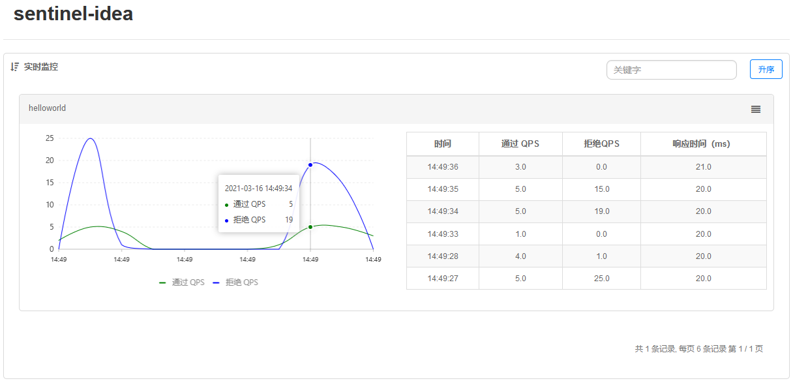

[TOC]

# 目录

## 1-14 哨兵控制台集成详解-1

### 控制台

- Semtomel Wiki
  - [English](https://github.com/alibaba/Sentinel/wiki/Dashboard)
  - [chinese](https://github.com/alibaba/Sentinel/wiki/%E6%8E%A7%E5%88%B6%E5%8F%B0)
- Github
  - git clone git@github.com:alibaba/Sentinel.git sentinel-src
  - IDEA 导入 Sentinel 打开里面的 sentinel-dashboard
    - [JVM 参数](https://github.com/alibaba/Sentinel/wiki/%E6%8E%A7%E5%88%B6%E5%8F%B0#22-%E5%90%AF%E5%8A%A8)："-Dserver.port=8080 -Dcsp.sentinel.dashboard.server=localhost:8080 -Dproject.name=sentinel-dashboard"
  - 浏览器输入： localhost:8080
    - 默认账户密码：sentinel/sentinel
    - 修改后账户：eddie/123456



```java
-Dserver.port=8080
-Dcsp.sentinel.dashboard.server=localhost:8080
-Dproject.name=sentinel-dashboard
-Dsentinel.dashboard.auth.username=eddie
-Dsentinel.dashboard.auth.password=123456
```

> 需要在 github 拉取的主目录 sentinel-parent 运行 mvn clean install

### 客户端连接控制台

[配置启动参数](https://github.com/alibaba/Sentinel/wiki/%E6%8E%A7%E5%88%B6%E5%8F%B0#3-%E5%AE%A2%E6%88%B7%E7%AB%AF%E6%8E%A5%E5%85%A5%E6%8E%A7%E5%88%B6%E5%8F%B0)



客户端指定控制台地址和端口、监控 API 的端口
```java
-Dcsp.sentinel.dashboard.server=localhost:8080
-Dcsp.sentinel.api.port=8719
-Dproject.name=sentinel-idea
```

> 1、 请求：POST localhost:8082/flow <br> 2、 再次访问 "http://localhost:8080" 就会显示"sentinel-idea"的模块 （懒加载）

快速请求 flow 接口后, 实时监控显示的


根据代码的阀值


同理, 也可以在页面上操作对应的流控规则
- 删除原来的流控规则： 流控规则 --> 操作"删除"
- 簇点链路 -->  点击"流控" --> QPS=5 ( or 线程数)
- 快速浏览器刷新 http://localhost:8082/flow 



> 新添加的配置是存在内存中

### 降级相关代码片

com.example.apollo.SentinelApplication.intFlowRules
```java
@SpringBootApplication
public class SentinelApplication {

    public static void intFlowRules() {
        List<FlowRule> rules = new ArrayList<FlowRule>();
        FlowRule rule = new FlowRule();
        //	注意： 我们的规则一定要绑定到对应的资源上，通过资源名称进行绑定
        rule.setResource("helloworld");
        rule.setGrade(RuleConstant.FLOW_GRADE_QPS);
        // 流控规则 - 阈值
        rule.setCount(10);
        rules.add(rule);
        // 规则管理器
        FlowRuleManager.loadRules(rules);
    }

    public static void main(String[] args) {
        SpringApplication.run(SentinelApplication.class, args);
		intFlowRules();
        System.err.println("规则加载完毕!");
    }
}
```

com.example.apollo.controller.DemoController.flow
```java
@RestController
public class DemoController {

    @RequestMapping("/flow")
    public String flow() throws InterruptedException {
        Entry entry = null;
        try {
            //	2.1 定义资源名称
            entry = SphU.entry("helloworld");
            //	2.2 执行资源逻辑代码
            System.err.println("helloworld: 访问数据库");
            System.err.println("helloworld: 访问远程redis");
            System.err.println("helloworld: 数据库持久化操作");
            Thread.sleep(20);
        } catch (BlockException e) {
            System.err.println("要访问的资源被流控了, 执行流控逻辑！");
        } finally {
            if (entry != null) {
                entry.exit();
            }
        }
        return "flow";
    }
}
```